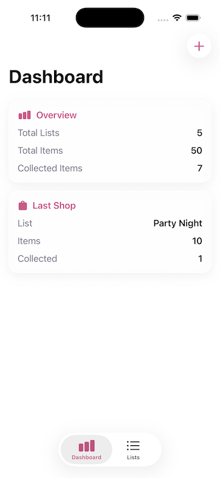
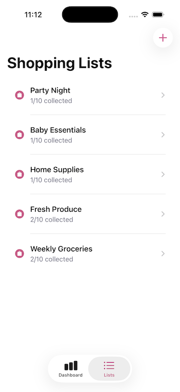
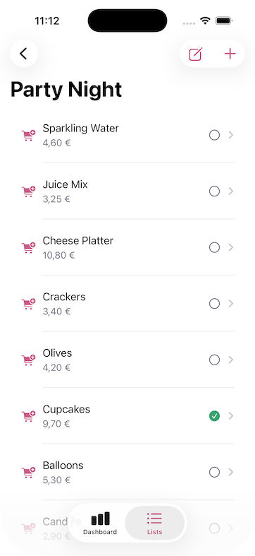
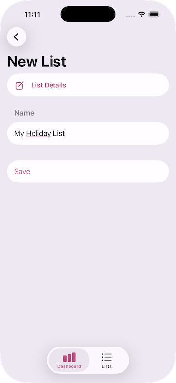
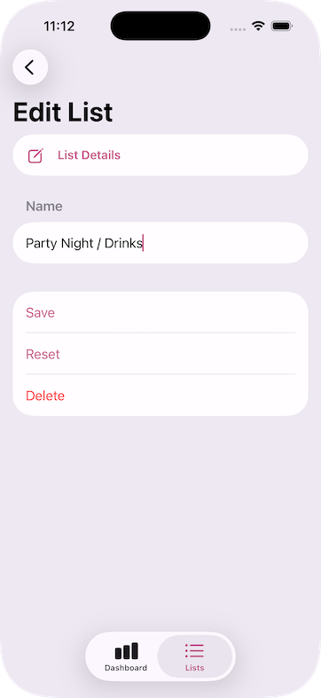
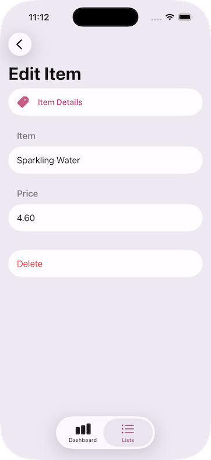
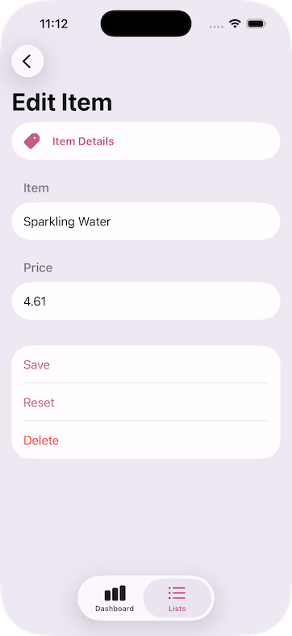

# SimpleShoppingList

SimpleShoppingList is an open-source SwiftUI sample project designed as a **handoff-ready scaffold** for junior and intermediate iOS developers.

The intent is to provide a practical, maintainable baseline that demonstrates MVVM structure, scene-owned navigation, protocol-based dependencies, and actor-backed persistence.

It is intentionally structured so developers can use it as a starting point for real product work.

## Screenshots









## Project Intent

- Provide a clean SwiftUI architecture baseline.
- Keep responsibilities separated (UI, navigation, state, persistence).
- Support multiple shopping lists and item-level editing workflows.
- Demonstrate protocol-first dependency design.
- Provide a learning-focused codebase that can evolve toward production.

## Tech Stack

- Swift 6
- SwiftUI
- Actor-based persistence store
- Async/await + AsyncStream for state updates
- JSON persistence in Documents directory

## Current Structure

```text
SimpleShoppingList/
  Components/   # Reusable UI components
  Models/       # Domain models + sample data
  Protocols/    # Protocol contracts
  Routes/       # Route enums for scene navigation
  Scenes/       # Navigation roots (own NavigationStack + destinations)
  Services/     # Concrete service/store implementations
  ViewModels/   # Presentation/business logic
  Views/        # Screen UI
```

## Architecture Overview

### 1. Scene-Driven Navigation

`Scene` types are navigation owners:

- `DashboardScene`
- `ShoppingListsScene`

Each scene owns:

- A `NavigationStack`
- `.navigationDestination(for:)` handlers for its route type

This keeps navigation predictable and centralized.

### 2. View / ViewModel Split

Views focus on rendering and user interaction wiring.

ViewModels focus on:

- Business logic
- Async workflows
- Derived screen state

This keeps UI code smaller and easier to maintain.

### 3. Store Layer + Persistence

`ShoppingStore` is an actor-backed store that persists to JSON in the app Documents directory.

It provides:

- List and item CRUD operations
- `listsStream()` via `AsyncStream` for updates
- On-launch load from persisted JSON

Why this matters:

- Actor isolation improves concurrency safety.
- `AsyncStream` gives ordered asynchronous updates.
- Data survives app restarts.

### 4. Protocol-Based Dependency Injection

Dependencies are referenced through protocols:

- `ServiceContainerProtocol`
- `ShoppingStoreProtocol`

Concrete implementations are injected at app composition.

This enables easier mocking and testing of view models/services.

## Core Feature Set

- Dashboard with totals and latest shopping list summary
- Multiple shopping lists
- Add/edit/delete shopping lists
- Add/edit/delete shopping list items
- Mark items as collected/purchased
- Item price support (numeric)
- Bootstrap seed data via `ServiceContainerProtocol` when store is empty

## Data Flow

1. User action in `View` / `Component`.
2. View forwards to `ViewModel`.
3. ViewModel calls store protocol methods.
4. Store mutates actor state and persists JSON.
5. Store emits latest snapshot through `AsyncStream`.
6. ViewModels update published state and SwiftUI re-renders.

## Persistence Details

The app writes shopping lists to a JSON file in the app Documents directory.

- Store: `Services/ShoppingStore.swift`
- Protocol: `Protocols/ShoppingStoreProtocol.swift`

On launch, `SimpleShoppingListApp` triggers store bootstrapping through `ServiceContainerProtocol` to seed mock data only when the store is empty.

## Build

From project root:

```bash
xcodebuild -project SimpleShoppingList.xcodeproj -scheme SimpleShoppingList -destination 'platform=iOS Simulator,name=iPhone 17 Pro' build
```

Or open `SimpleShoppingList.xcodeproj` in Xcode and run the `SimpleShoppingList` scheme.

## Suggested Next Steps

- Add focused unit tests for view models and store logic.
- Add CI build/lint/test pipeline.
- Add localization + accessibility audit.
- Add data migration strategy for future model changes.
- Add import/export backup flow.

## Audience

This repository is useful for:

- Junior/intermediate Swift developers learning scalable app structure.
- Teams needing a clean SwiftUI foundation.
- Projects requiring protocol-oriented DI + actor-backed persistence.
